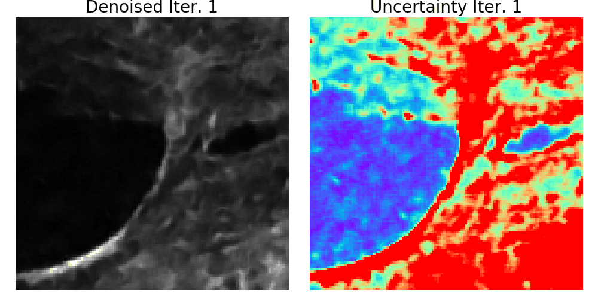

# Learned, uncertainty-driven adaptive acquisition for photon-efficient scanning microscopy

The official PyTorch implementation of the [Learned, uncertainty-driven adaptive
acquisition for photon-efficient scanning
microscopy](https://arxiv.org/abs/2310.16102)

<div align="center">
  
  <br/>
  <div align="left" width="60%">
    <figcaption display="table-caption" width="60%"> <b>Image prediction and predicted uncertainty when denoising using 1 to 20 noisy scanning microscopy images. As the number of measurements increases, the predicted image more closely matches the ground truth, and the pixel-wise uncertainty decreases.</b></figcaption>
  </div>
</div>

# Setup: 

Clone this project using:

```
git clone https://github.com/cassandra-t-ye/Learned_Uncertainty_Quantification.git
```

Dependencies can be installed using

```
conda env create -f environment.yml
source activate learned_uncertainty
```

# Dataset:

The FMD dataset we used can be downloaded [here](https://github.com/yinhaoz/denoising-fluorescence) <br>
The Experimental MPM dataset we used can be downloaded [here](https://drive.google.com/drive/folders/1DYUYBe7rm--mcpPVPKBcuhgHmfooy9e7?usp=sharing)


# Getting Started:

To get started, download the weights and visualization data for our finetuned model here:

- [Weights](https://drive.google.com/file/d/1t7hAASo-FFw1SOTXDozE5vhFgeDwk11s/view?usp=sharing)  
- [Visualization Data]()

Once finished, put these files in the main repo, open either quickstart_FMD.ipynb or quickstart_MPM and get started!

# Notes on Conformal Calibration:

In section 3.2 of our paper, we explain the details of calibrating our predicted uncertainty intervals to ensure statistical coverage. The functions used for calibration can be found in conformal_distribution.ipynb. 


